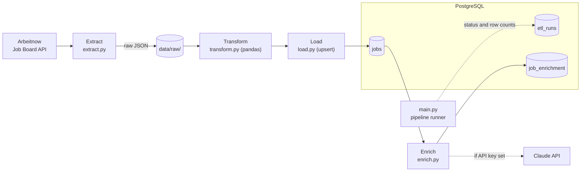

# job-market-etl

**Which skills does the job market ask for?** This project answers that with data. It is a
small, complete ETL pipeline that downloads current job postings from the public
[Arbeitnow Job Board API](https://www.arbeitnow.com/api/job-board-api) (mostly jobs in
Germany and Europe), cleans them with pandas, loads them into PostgreSQL, and classifies each
job by **seniority**, **category** and **required skills**. The last step uses the Claude API
when an API key is set, or free keyword rules otherwise. Everything runs with one
`docker compose` command.

Built with Python 3.14, pandas, PostgreSQL 17, Docker Compose, pytest and the Anthropic SDK.

## Architecture



| Step | What it does |
|------|--------------|
| **Extract** | Downloads the first `MAX_PAGES` pages (default 3, about 600 jobs) and saves the raw JSON unchanged to `data/raw/`. |
| **Transform** | Converts HTML descriptions to plain text, removes gender markers like `(m/w/d)` from titles, converts timestamps, drops invalid and duplicate rows. |
| **Load** | Upserts the jobs into `jobs`: new jobs are inserted, known jobs are updated. |
| **Enrich** | Adds seniority, category and skills to `job_enrichment`, using Claude or keyword rules. |

## Quick start (Docker only)

Requirements: [Docker Desktop](https://www.docker.com/products/docker-desktop/) (includes
Docker Compose) and git. Python is not needed on your machine.

```bash
git clone https://github.com/NagyDominik1/job-market-etl.git
cd job-market-etl
cp .env.example .env          # Windows PowerShell: Copy-Item .env.example .env
docker compose up --build
```

This starts PostgreSQL, waits until it is healthy, then runs the pipeline once. After about
a minute you should see:

```
INFO src.load: Load: rows in=584, inserted=584, updated=0 (jobs table: 0 -> 584 rows)
WARNING src.enrich: ANTHROPIC_API_KEY is empty, using the free rule-based fallback instead of Claude
INFO src.enrich: Rule-based enrichment: 584 jobs classified
INFO __main__: ETL run id=1 succeeded: extracted=600, loaded=584 (inserted=584, updated=0), enriched=584
pipeline-1 exited with code 0
```

PostgreSQL keeps running so you can query the data. Press `Ctrl+C` to stop it, or run
`docker compose down` (add `-v` to also delete the data).

To classify jobs with Claude instead of rules, set `ANTHROPIC_API_KEY=...` in `.env` and run
the pipeline again. Up to `ENRICH_LIMIT` jobs (default 20) are sent to Claude per run.

## Look at the data

Run the pipeline again at any time (existing jobs are updated, not duplicated):

```bash
docker compose run --rm pipeline
```

Open a SQL shell (use the user and database name from your `.env`; with the defaults from
`.env.example` that is `change_me` / `job_market`):

```bash
docker compose exec postgres psql -U change_me -d job_market
```

Some queries to try:

```sql
SELECT title, company_name, location, posted_at FROM jobs ORDER BY posted_at DESC LIMIT 10;
SELECT j.title, e.seniority, e.category, e.skills
FROM jobs j JOIN job_enrichment e USING (slug) LIMIT 10;
SELECT id, status, started_at, rows_extracted, rows_loaded, rows_enriched, error_message
FROM etl_runs ORDER BY id;
```

Or run the prepared analysis queries in [`sql/analysis.sql`](sql/analysis.sql):

```bash
docker compose exec -T postgres psql -U change_me -d job_market < sql/analysis.sql
# Windows PowerShell:
Get-Content sql/analysis.sql | docker compose exec -T postgres psql -U change_me -d job_market
```

## Example results

Real output of `sql/analysis.sql` from a run on 23 September 2026: 584 jobs, classified with
the free rule-based fallback.

**Top 10 skills overall**

```
   skill    | jobs
------------+------
 Python     |   86
 LLM        |   48
 Excel      |   45
 Kubernetes |   43
 AWS        |   42
 SQL        |   37
 CI/CD      |   35
 GCP        |   31
 HubSpot    |   31
 Docker     |   28
```

**Top 10 skills in data jobs** (category `data`)

```
   skill    | jobs
------------+------
 Python     |   14
 SQL        |   14
 AWS        |    6
 CI/CD      |    5
 dbt        |    4
 Kafka      |    4
 Kubernetes |    4
 LLM        |    4
 Power BI   |    4
 Tableau    |    4
```

**Jobs per seniority level**

```
 seniority | jobs
-----------+------
 intern    |   64
 junior    |    7
 senior    |  130
 lead      |   84
 unknown   |  299
```

Half the titles don't state a level, so "unknown" is the largest group. The rules only look at
the title; Claude also reads the description (e.g. "5+ years of experience").

## Design decisions

- **Retries and timeouts.** Every API request has a timeout (5 s to connect, 30 s to read).
  Temporary failures (connection errors, timeouts, HTTP 429 and 5xx) are retried 3 times with
  exponential backoff. Other errors like 404 fail at once, because retrying wouldn't help.
  Extraction is all-or-nothing: if one page fails, no file is written.
- **Raw data is kept.** Each run saves the API response unchanged to
  `data/raw/jobs_<timestamp>.json` before any cleaning. If a cleaning rule turns out to be
  wrong, the data can be re-processed without calling the API again.
- **Idempotent upsert.** `INSERT ... ON CONFLICT (slug) DO UPDATE` means running the pipeline
  twice never creates duplicates. `first_seen_at` is kept and `last_seen_at` is updated, which
  shows how long a job has been online.
- **One transaction for the load.** All rows are written in a single transaction. If anything
  fails, everything is rolled back, so the table is never half-loaded.
- **Run log in `etl_runs`.** Every run is recorded as `running`, then `success` (with row
  counts) or `failed` (with the error message). This log is written over a separate database
  connection, so a failure record survives even when the data load is rolled back. A failed
  run exits with code 1, so a scheduler can detect it.
- **Docker.** One command starts the database and the pipeline on any machine. The pipeline
  waits for the database healthcheck, runs as a non-root user, and the image contains no
  secrets (`.env` is excluded by `.dockerignore`). Dependencies are installed before the code
  is copied, so rebuilds after a code change take seconds.
- **Validating AI output.** Claude must answer in a fixed JSON format (structured outputs with
  a JSON schema). The answer is then checked again in Python (allowed values, skill spelling
  like `postgres` → `PostgreSQL`, duplicates, at most 10 skills), and the table has `CHECK`
  constraints as a last safety net. Job descriptions are untrusted text from the internet, so
  the prompt tells Claude to treat them as data and ignore any instructions inside them.
  Each Claude result is committed separately, so work that was already paid for is never lost.
  An enrichment problem is logged as a warning and never fails the run, because the jobs are
  already loaded at that point.
- **Rule-based fallback vs. Claude.** Without an API key, keyword rules
  ([`src/rules.py`](src/rules.py)) classify all jobs for free in a few seconds. They handle
  tricky names ("Go" and "R" only count inside a list of technologies; `C++`, `C#`, `.NET`;
  "Java" is not matched inside "JavaScript"), but they can't read context: "Spark Capital"
  (an investor) counts as Spark, and "Software Engineer" can only be `other`. Claude
  understands context and the description, but costs money and time per job. So Claude runs
  only on up to `ENRICH_LIMIT` jobs per run, and it upgrades rule-based results over later runs.
  Each row stores which one produced it in `job_enrichment.model`.

## Limitations and next steps

- **Scheduling.** The pipeline runs when started. Next step: run it daily with cron, or with
  an orchestrator like Airflow if more pipelines are added.
- **Schema migrations.** `sql/init.sql` only runs on an empty database; a schema change
  currently means resetting the database (`docker compose down -v`). Next step: versioned
  migrations with Alembic.
- **Re-enrich changed jobs.** A job is enriched once; if its title or description changes
  later, the enrichment is not redone. Next step: store a hash of the text that was classified
  and re-enrich when it changes.
- **Only the newest pages.** Each run fetches the first `MAX_PAGES` pages. Jobs that disappear
  from the API stay in the table (their `last_seen_at` stops changing), and the API's order can
  shift while paging, which is why some jobs appear twice (they are de-duplicated).
- **Tests.** 75 unit tests cover cleaning, validation and the rules. Next step: integration
  tests against a test database, run automatically with GitHub Actions.

## Project structure

```
├── docker-compose.yml   # postgres + pipeline services
├── Dockerfile           # image for the pipeline
├── requirements.txt     # pinned Python dependencies
├── sql/
│   ├── init.sql         # database schema (jobs, etl_runs, job_enrichment)
│   └── analysis.sql     # example analysis queries
├── src/
│   ├── main.py          # pipeline runner: extract -> transform -> load -> enrich
│   ├── extract.py       # API download with retries and pagination
│   ├── transform.py     # cleaning with pandas
│   ├── load.py          # upsert into PostgreSQL
│   ├── enrich.py        # classification with Claude or rules
│   ├── rules.py         # the free rule-based classifier
│   └── db.py            # database connection from environment variables
└── tests/               # pytest unit tests (no network or database needed)
```

## Local development

For working on the code: PostgreSQL runs in Docker, the Python code in a local virtual
environment. Commands are shown for Windows; on macOS/Linux use `.venv/bin/python`.

```bash
cp .env.example .env                                    # then edit the values
docker compose up -d postgres                           # start only the database
python -m venv .venv
.venv\Scripts\python -m pip install -r requirements.txt
```

Run the whole pipeline, or one step at a time:

```bash
.venv\Scripts\python -m src.main        # extract -> transform -> load -> enrich
.venv\Scripts\python -m src.extract     # only download to data/raw/
.venv\Scripts\python -m src.transform   # only clean the newest raw file and show the result
.venv\Scripts\python -m src.enrich      # only enrich jobs already in the database
```

Run the tests (locally or in the container):

```bash
.venv\Scripts\python -m pytest
docker compose run --rm pipeline python -m pytest
```

### Configuration

All settings are environment variables, read from `.env` (variables already set in your
shell take priority):

| Variable | Default | Meaning |
|----------|---------|---------|
| `POSTGRES_DB`, `POSTGRES_USER`, `POSTGRES_PASSWORD` | – | Database name and credentials |
| `POSTGRES_HOST`, `POSTGRES_PORT` | `localhost`, `5432` | Where the Python code connects (Docker Compose sets `postgres` for the container) |
| `API_URL` | `https://www.arbeitnow.com/api/job-board-api` | First API page to download |
| `MAX_PAGES` | `3` | Maximum number of API pages per run |
| `ANTHROPIC_API_KEY` | empty | Claude API key; empty = rule-based fallback |
| `ANTHROPIC_MODEL` | `claude-haiku-4-5-20251001` | Claude model for enrichment |
| `ENRICH_LIMIT` | `20` | Maximum jobs sent to Claude per run; `0` turns enrichment off |

### Changing the database schema

`sql/init.sql` only runs when the database is created for the first time. After changing it,
reset the database; the pipeline reloads the jobs from the API:

```bash
docker compose down -v      # deletes ALL data in the database
docker compose up --build
```
